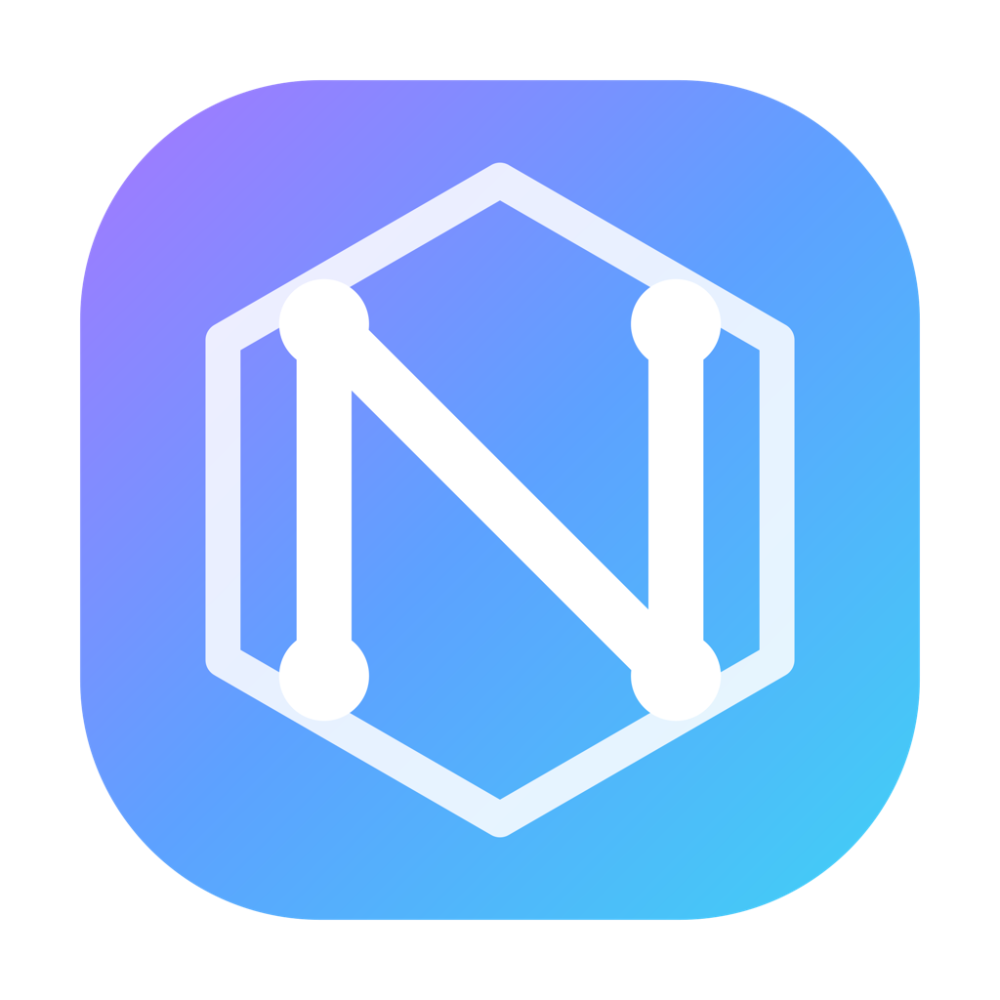

<div align="center">



# NeuraBar

**Your macOS menu bar, supercharged.**
A small, fast, opinionated workspace that lives in the menu bar — tasks, focus, clipboard, notes, automations, and multi-provider AI, one click away.

[](#)
[](#)
[](#development)
[](#languages)
[](#license)

</div>

---

## Why NeuraBar?

Most menu-bar apps do one thing. NeuraBar gives you **eight tools you actually use every day** in a single popover, with keyboard shortcuts, a command palette, and an AI chat that can talk to whatever CLI or API you already have installed.

- **Minimal.** One click. No onboarding. No cloud account.
- **Effective.** ⌘K palette. ⌘1–⌘8 to jump tabs. Slash commands in chat.
- **Private.** All data stays in `~/Library/Application Support/NeuraBar/` as plain JSON.
- **Pluggable.** Detects 10+ coding CLIs (Claude Code, Codex, Aider, opencode, Gemini, Amp, Goose, …) and 4 desktop apps automatically. Bring your own key or run locally via Ollama.

---

## Features

| Tab | What it does |
|---|---|
| ✓ **Tasks** | Lightweight to-dos with tags and filters (Active / All / Done). |
| ⏱ **Focus** | Pomodoro with 25/5/15 cycles, macOS notifications, session counter. |
| ▦ **Shortcuts** | Quick-launch tiles for apps, folders, URLs, and shell commands. |
| ✨ **Automate** | 12 one-click automations with structured run history and approvals for destructive actions. |
| ⎘ **Clipboard** | Persistent history with search, pinning, and dedup — survives restarts. |
| ✎ **Notes** | Multi-note sidebar, auto-save, no formatting to fight. |
| ▤ **System** | CPU, memory, disk, battery — live gauges, cheap to run. |
| ⚡ **AI** | Multi-provider chat with live streaming, approvals, and `/slash` automation commands. |

---

## AI Providers

NeuraBar auto-detects what you already have. Pick any of them from the provider bar at the top of the AI tab.

| Type | Providers |
|---|---|
| **CLI** (local streaming) | `claude`, `codex`, `aider`, `opencode`, `gemini`, `amp`, `goose`, `qwen-code`, `plandex`, `continue`, `ollama` |
| **API** | Anthropic Claude, OpenAI |
| **Desktop apps** (handoff) | Claude Desktop, ChatGPT, Codex, ChatGPT Atlas |

> If nothing is detected, NeuraBar prompts you for an API key — no hidden defaults.

**In-chat commands:**

```
/screenshots        → sort Desktop screenshots by month
/trash              → empty the Trash (destructive, asks for approval)
/heic               → convert HEIC → JPG on Desktop
/ (any text)        → filters the slash menu
```

Type something like `clean my downloads` and suggested automation chips appear above the input.

---

## Automations

Grouped into three categories. Each action runs in the background and returns a structured result with stats and a run history.

| Category | Actions |
|---|---|
| **Files** | Sort screenshots · Sort Downloads by type · HEIC → JPG · Largest files report · Archive old downloads |
| **Cleanup** | Installer sweep (.dmg/.pkg/.msi) · Purge .DS_Store · Empty Trash · Clean Xcode DerivedData |
| **System** | Toggle hidden files · Lock screen · Sleep display |

Destructive actions (trash, derived, hidden toggle, lock, sleep) require an explicit **Approve** press.

---

## Install

Requires macOS 14+ and the Xcode Command Line Tools.

```bash
git clone <this-repo> NeuraBar
cd NeuraBar
./build.sh install
```

That builds, ad-hoc signs, copies the `.app` to `/Applications/`, and opens it. You'll see a hex-shaped glyph in your menu bar.

Try it once without installing:

```bash
./build.sh
open NeuraBar.app
```

---

## Languages

Auto-detects from your macOS language. Override in **Settings → General → Language** (System / English / Türkçe).

All user-facing strings live in a single catalog (`Localization.swift`). A test validates every key has an English translation.

---

## Keyboard Shortcuts

| Keys | Action |
|---|---|
| `⌘K` | Command palette (search across tabs, todos, notes, clipboard, actions) |
| `⌘1` – `⌘8` | Jump to tab |
| `⌘,` | Settings |
| `⌘Q` | Quit |
| `↑ ↓ Enter Esc` | Navigate palette / slash menu |

---

## Daily use, not demo-ware

NeuraBar is deliberately **small**. Everything is in one window, loads in milliseconds, and persists to plain JSON files you can `cat` and back up.

- **Clipboard history survives reboots** (`clipboard.json`, 200 items, pinning).
- **Automation runs are logged** (`automation_history.json`, last 50 with timing + stats).
- **Settings are tolerant** — old `settings.json` files keep working when new fields ship.
- **No telemetry. No accounts. No background services.**

---

## Development

```bash
swift build -c release           # produce .build/release/NeuraBar

./build.sh                       # build + create NeuraBar.app
./build.sh install               # build + install to /Applications

# Tests (71 passing, ~6s)
DEVELOPER_DIR=/Applications/Xcode.app/Contents/Developer swift test
```

### Project layout

```
NeuraBar/
├── Package.swift
├── Info.plist
├── build.sh
├── NeuraBar.icns
├── assets/                       # logo PNGs used by README
├── Sources/NeuraBar/
│   ├── NeuraBarApp.swift         # @main + AppStore
│   ├── MainView.swift            # popover shell, tab bar, palette
│   ├── CommandPalette.swift      # ⌘K fuzzy search
│   ├── WindowManager.swift       # pop-out window + popover↔window mutex
│   ├── Localization.swift        # EN / TR catalog
│   ├── Theme.swift               # design tokens + glass helpers
│   ├── Logo.swift                # NeuraMark, splash, pulse, watermark
│   ├── Persistence.swift         # JSON store + Settings sheet
│   └── Features/
│       ├── Todos.swift
│       ├── Pomodoro.swift
│       ├── Shortcuts.swift
│       ├── Automation.swift      # catalog + runner + history
│       ├── Clipboard.swift       # persistent + pin
│       ├── Notes.swift
│       ├── System.swift          # CPU/RAM/disk/battery
│       ├── AIProviders.swift     # detection + invocation
│       └── Assistant.swift       # chat, slash commands, approvals
└── Tests/NeuraBarTests/          # 71 XCTest cases, isolated temp dir
```

---

## Design notes

- **2026-era UI:** glass-style surfaces, matched-geometry tab transitions, spring animations, a breathing logo, gradient watermark in the big window.
- **Pop-out.** Click the ⇲ button in the header and NeuraBar opens as a resizable 820×720 window; the popover closes automatically.
- **Provider auto-detect.** On every open, the AI tab scans `/usr/local/bin`, `/opt/homebrew/bin`, `~/.local/bin`, `~/.cargo/bin`, `~/.bun/bin`, and falls back to a login-shell `command -v`.
- **Launch at login** via `SMAppService.mainApp` — no helper bundle.

---

## License

MIT. Use it, fork it, ship something nicer.

---

<div align="center">

Built with ♥ on macOS · <a href="https://github.com/bayrameker">@bayrameker</a>

</div>
